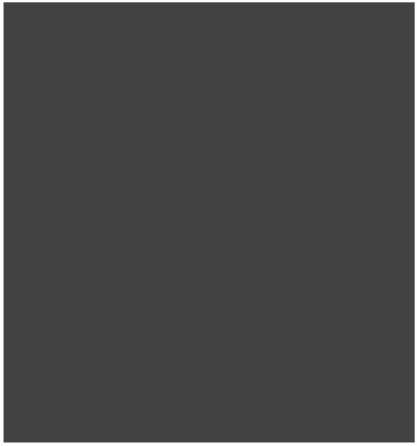
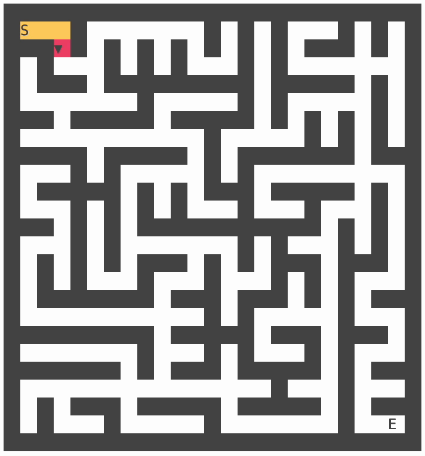
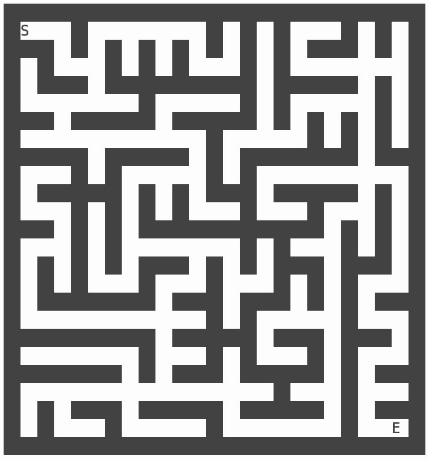
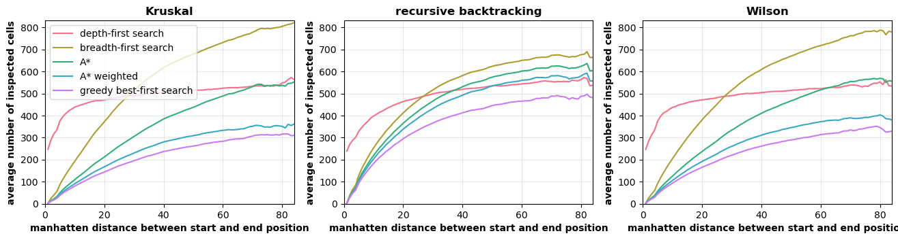
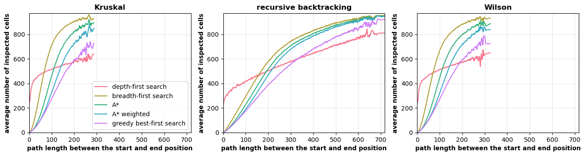

# mazes
Maze-generation and maze-solving written in Rust and visualized in the terminal.  

## Overview.

### Implemented maze-generation algorithms.
* Kruskal
* Wilson
* Recursive backtracking

### Implemented maze-solving algorithms.
* Breadth-first search (BFS)
* Depth-first search (DFS)
* Best-first search (greedy)
* A*
* A* (weighted)
* Wall-follower

## Key bindings.

| Key | Functionality |  
| :---:   | :---: |  
| `r` | re-create the maze |  
| `e` | re-draw the maze |  
| `d` | delete the maze |  
| `k` or `↑` | increase size of the maze |  
| `j` or `↓` | decrease size of the maze |  
| `1` - `5` | set the number of mazes |  
| `o` | rotate the order of multiple mazes |  
| `n` | set the start and end position at random positions |  
| `m` | reset the start and end position to the top left and bottom right corner |  
| `s` | solve the maze |  
| `f` | solve the maze but only display the path |  
| `h` | switch to the next generation algorithm |  
| `l` | switch to the next solving algorithm |  i
| `a` | toggle animation on / off |  
| `g` | toggle graph visualization on / off |  
| `p` | toggle grid visualization on / off |  
| `b` | toggle binary representation on (with / without background) / off |  
| `t` | start benchmarking |  
| `CTRL + l` | redraw the whole application |  
| `q` | quit the application |  

## Notes.

In order to make the visualization of the mazes more appealing, change the size of the cells in your terminal so they are square. In kitty you can change this using the [modify_font setting](https://sw.kovidgoyal.net/kitty/conf/#opt-kitty.modify_font).

For understanding and implementing the algorithms, the Python API [mazelib](https://github.com/john-science/mazelib/tree/main) was very helpful. If you are interested how the algorithms work, see the linked github-repository for the provided documentation.

## Animations

### Generation: Kruskal

### Generation: Recursive Backtracking

### Generation: Wilson

### Solving: Wall Follower

### Solving: Breadth-First Search

### Solving: Depth-First Search

### Generation: A*

### Generation: A* (weighted)

### Generation: Greedy Best-First Search

## Benchmark

The implemented algorithms were compared by creating 25.000 mazes (size 45x45) per generation algorithm and solving them using the different solving algorithms. The solving algorithms can be compared by the number of inspected cells. For each maze the start and end positions were once at the upper left and bottom right corner and 25 times at random positions.

  

